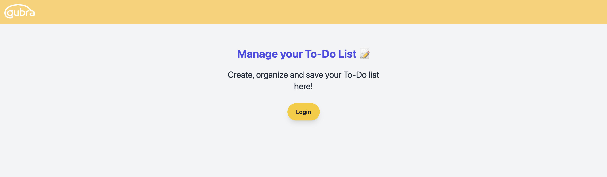
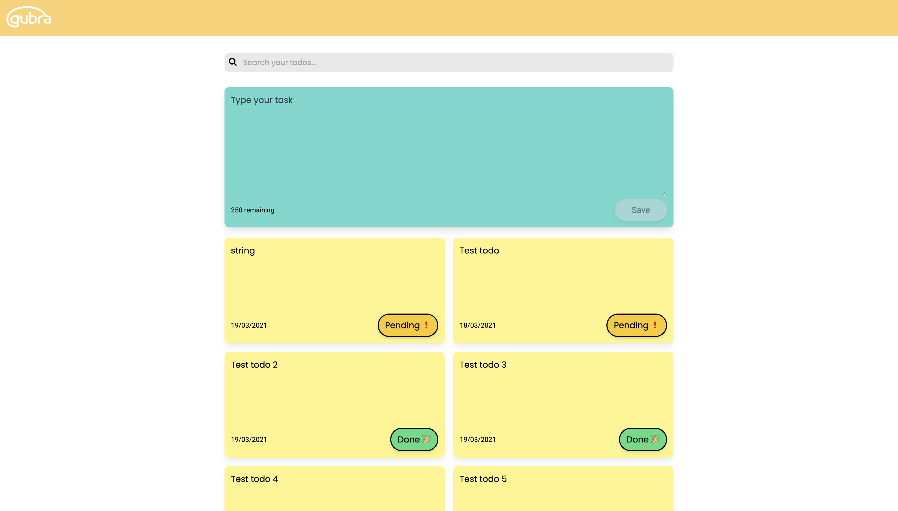

# Gubra To-Do App 

This project was bootstrapped with [Create React App](https://github.com/facebook/create-react-app).

## Clone the project

```
git clone https://github.com/Gubra-A-S/fastapi-todo-app.git
```

## Install dependencies

### `npm install`

## Run locally
In the project directory, you can run:

### `npm start`

Runs the app in the development mode.\
Open [http://localhost:3000](http://localhost:3000) to view it in your browser.

The page will reload when you make changes.

## Screenshot:

### Landing Page


### App



