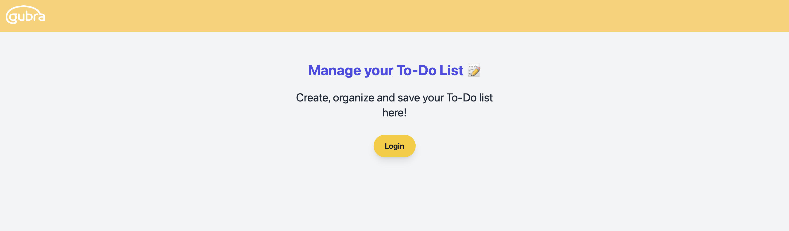
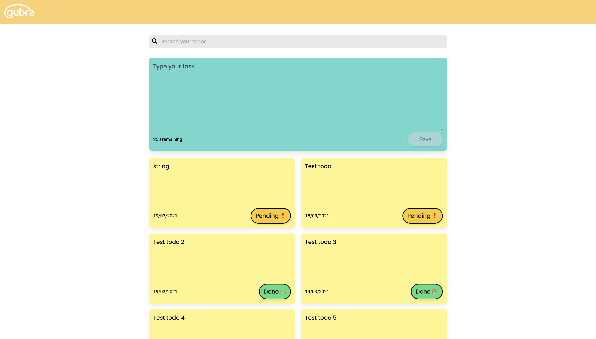

# Gubra To-Do App 

Front end of the To-Do app for Gubra, using React + Tailwind. 

## Clone the project

```
git clone https://github.com/Gubra-A-S/fastapi-todo-app.git
```

## Install dependencies

### `npm install`

## Run locally
In the project directory, you can run:

### `npm start`

Runs the app in the development mode.\
Open [http://localhost:3000](http://localhost:3000) to view it in your browser.

The page will reload when you make changes.

## Screenshot:

### Landing Page


### App



## Backend

The backend of the app can be found in the following PR: [Backend To-Do](https://github.com/Gubra-A-S/fastapi-todo-app/pull/1).

## Login/Authorization

To access the app, a username/password is required, which can be set in the backend. I recommend checking the PR with the documentation.
